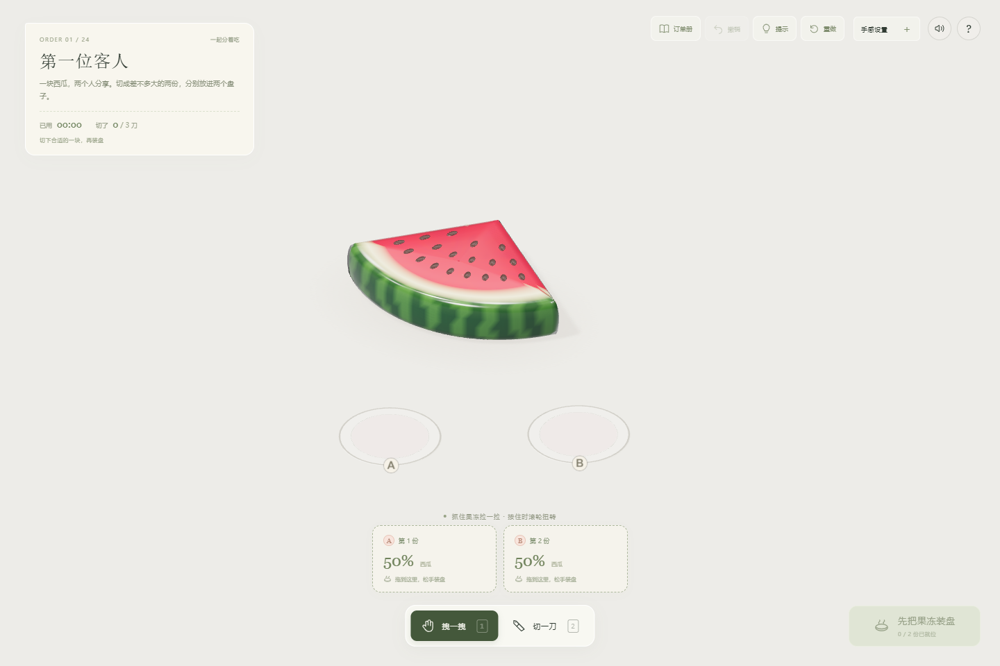
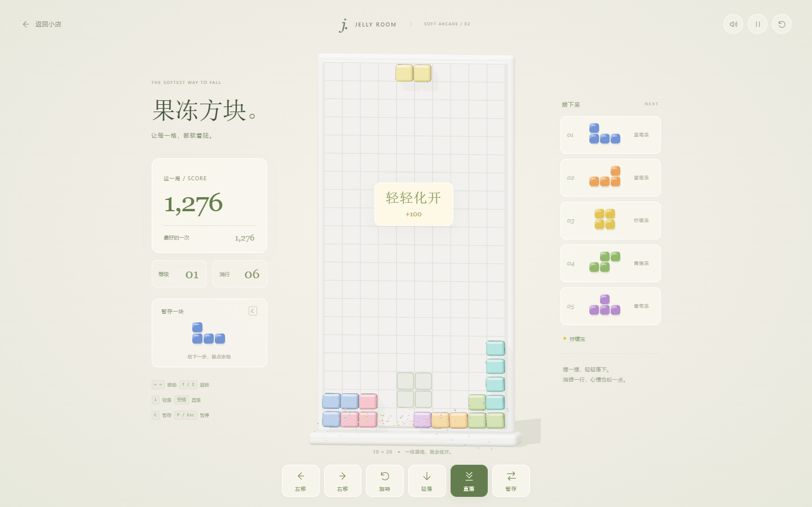

# 慢慢切 · 果冻小店

[在线试玩](https://whatever19951206-stack.github.io/jelly-room/) · [下载离线成品](https://github.com/whatever19951206-stack/jelly-room/releases/latest)

一个离线可玩的三维果冻小店 demo，参考用户视频及 [Melon Jelly Knife](https://claude.ai/artifact/RiTbBMEqgfNwgMHMTAhf5P) 的拖拽、受压和切割手感制作。

已加入完整循环：读订单 → 按比例切配 → 装盘 → 交单评星 → 解锁下一单。24 个订单分为六章，涉及均分、不等份、刀数限制、瓜心与果皮、指定盘位和双口味综合订单。72 颗星、11 枚印章、每日练习及后续随机练习提供重复挑战，自由沙盒保留。

首轮内容设计估算约 30–50 分钟，熟练玩家可更快完成；这不是实测平均时长，也没有用强制等待延长游戏。

新增「果冻方块」：经典下落拼块玩法搭配三维果冻。旋转时轻晃，落地后压扁回弹，消行后上面的果冻落下继续晃动。含七种形状、下一块预览、暂存、落点提示、连消计分和速度升级，支持键盘与手机按钮。

## 直接开始

双击 `成品/慢慢切.html`，或根目录的 `index.html`，使用新版 Chrome / Edge 打开即可。
不需要安装、不需要联网、不需要登录。首次点击后开启声音。

## 怎么玩

先点击「开始接单」。切刀悬停会预览切后的分量。选中一块后把它拖进订单盘，或点击对应订单盘交付；点击已装盘的餐盘可取回。全部装好后点「交给客人」。切错可撤销；交单失败可「继续调整」保留桌面。

分量相对于每种口味最初的整块，变形不会改变重量。每盘只收一块。订单刀数是上限，时间只加分。通关、星星与印章自动保存在当前浏览器，重开或关闭后未提交订单重新开始。详细路线与评分见 `docs/使用说明.md`。

下面的口味切换及晃动按钮可在「自由玩」中使用；接单时可用快捷键 J 晃动桌上未装盘的果冻。

- **拽一拽**：按住果冻的一角拖动，附近果肉会伸长，松手后回弹。快速拖动再松开可以甩出、翻转碎块。
- **扭一扭**：拖住果冻时滚动滚轮，或保持第一根手指不动、用第二根手指绕转。
- **切一刀**：选择切刀，划一条线，松手后按画线方向切开。也可以直接点击按当前角度下刀。刀会先压出凹陷，再切开。每一块仍能独立拖动、翻滚和继续切。
- **转刀**：滚轮、Q / E，或界面的 ↶ ↷ 按钮。
- **换口味**：西瓜、蜜橙、葡萄。切换口味会换上一整块果冻。
- **手感设置**：桌面及触屏都可展开，分别调整软糯程度和内部阻尼。
- **观察物理**：手感设置内有 ¼ 速度、体积网格、暂停及实时体积／动能读数。
- **晃一晃**：让桌上的所有果冻一起弹起来。
- **重新开始**：点击圆形箭头，换上新的完整果冻。

快捷键：`1` 拖拽、`2` 切刀、按住 `空格` 临时切刀、`Q / E` 转刀、`U` 撤销、`Enter` 交单、`R` 重来、`J` 晃动、`M` 声音、`H` 玩法、`Esc` 订单册。
触屏支持拖拽、划线切割、点按切割和双指扭转，使用屏幕按钮切换工具和转刀。

## 果冻方块

主菜单点击「果冻方块」，再点「开始这一局」。填满一整行即可消除，每消除 10 行升一级，堆到顶部就结束。规则按格子计算，果冻的视觉变形不影响落点。

- `← / →` 移动，`↑` 顺时针旋转，`Z` 逆时针旋转。
- `↓` 加速下落，`空格` 直接落到底。
- `C` 暂存一块，每次落地后才能再次暂存。
- `P / Esc` 暂停，`M` 切换本模式声音。手机使用画面下方按钮，也可在棋盘上滑动。

返回小店会暂停当前这一局，再进入可继续；关闭页面后这一局不保留。最高分自动保存在当前浏览器，与小店订单进度分别记录。

## 运行要求

支持 WebGL 2 的现代浏览器。建议开启硬件加速。手机可通过浏览器打开托管后的页面；部分手机文件管理器不能直接运行 HTML，请使用电脑直接打开。
场景最多保留 36 块；极小切片会被保留，避免产生不可操作的碎屑。

## 开发

- `npm install` 安装开发依赖。
- `npm run build` 重新生成完全独立的 HTML 成品。
- `npm start` 启动本地预览：`http://127.0.0.1:4173`。
- `npm test` 检查切割几何、体积物理、局部抓取、翻转、切块继承，以及全部订单的真实多边形切割解、评分与存档规则。
- `node tests/shop-smoke.cjs` 检查三种屏幕上的实际首单、结算与存档流程。
- `node tests/jelly-blocks-browser.cjs` 检查桌面与触屏的方块操作、暂停、暂存、结束、重开以及返回小店。
- `node tests/campaign-playthrough.cjs` 检查浏览器内真实切配交付；`node tests/campaign-physics.cjs` 检查反复装盘、撤销、混合原料与碎块压力。
- 原有 `regression.cjs`、`interaction-check.cjs`、`touch-check.cjs`、`controls-check.cjs` 与 `layout-check.cjs` 覆盖自由玩。浏览器测试使用 Playwright；先执行 `npx playwright install chromium`，也可通过 `BROWSER_PATH` 指定本机浏览器。详细步骤见 `tests/README.md`。

## GitHub Pages

仓库包含自动测试及 Pages 部署配置。推送到 `main` 后会重新测试、构建，并发布单文件游戏与第三方许可证。首次发布时，在仓库的 **Settings → Pages → Build and deployment** 中将 Source 设为 **GitHub Actions**；也可以在 Actions 中手动运行 Pages 工作流。

线上游戏不需要后端、账户或环境变量。进度保存在玩家自己的浏览器。

实现：Three.js / WebGL 2 渲染、自建四面体网格、固定 120 Hz XPBD 距离／体积约束、局部软抓取、内部相对速度阻尼、三维碰撞、凸多边形重新剖分和程序合成音效。表面及种子通过四面体重心坐标随果肉变形，切块继承原网格的姿态与速度。
所有材质、种子、果皮、光照均由程序生成，没有远程资源、广告或数据上传。原作采用 WebGPU 自定义着色；此版本使用本地 WebGL 2 实现，以兼容双击离线运行。
Three.js 使用 MIT 许可证，随成品附上并嵌入单文件 HTML；其他说明见 `THIRD_PARTY_NOTICES.md`。
